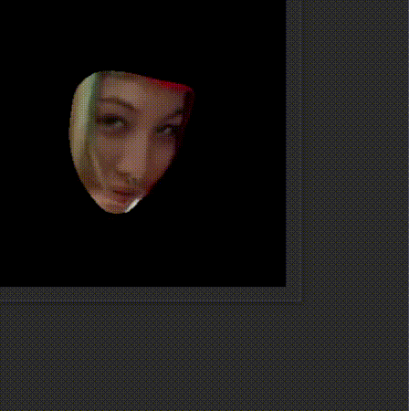

# Contents
- [Demos](https://github.com/tsen-dev/face-cropper#demos)
- [Overview](https://github.com/tsen-dev/face-cropper#overview)
- [Applications](https://github.com/tsen-dev/face-cropper#applications)
- [User Guide](https://github.com/tsen-dev/face-cropper#user-guide)

# Demos

# Overview
Implements the following pipeline for cropping out faces from an image:
1. Retrieves bounding boxes and approximate eye coordinates for faces in the image, using MediaPipe's [FaceDetection](https://google.github.io/mediapipe/solutions/face_detection.html) network:

    
   

2. For faces with in-plane rotation (i.e. roll), the [FaceDetection](https://google.github.io/mediapipe/solutions/face_detection.html) network gives bounding boxes that are smaller than the face, hence:
    1. The approximate roll of a face is found by calculating the angle between the line going through the eye coordinates and the horizontal
    2. The bounding boxes are inflated by a factor relative to the roll of the faces, to ensure bounding boxes include the full face under rotation
    
    
    

3. The inflated bounding boxes are cropped from the image and passed to MediaPipe's [FaceMesh](https://google.github.io/mediapipe/solutions/face_mesh.html) network to retrieve face landmark coordinates
   
   
   
    - This stage of the pipeline can optionally be configured to also do either/both of the following:
        - Remove background: Set all non-face pixels (i.e. pixels outside the mesh formed by the face landmarks) to 0:
          
            
        
        - Correct roll (enabled by default): Calculate accurate roll angle using eye landmark coordinates of [FaceMesh](https://google.github.io/mediapipe/solutions/face_mesh.html) (like in step 2) and correct the roll of the face by rotating the image (and landmarks) in the opposite direction around the midpoint between the eyes:
  
            

          
4. The image is then cropped to the minimum rectangle spanning all face landmarks:

   - Without roll-correction:
      
      
   
   - With roll-correction:
   
      

The eye coordinates from the [FaceDetection](https://google.github.io/mediapipe/solutions/face_detection.html) network in step 1 are not used to correct the roll as they are not accurate enough and are only good enough for getting an approximate roll angle
  

[FaceMesh](https://google.github.io/mediapipe/solutions/face_mesh.html) has an integrated [FaceDetection](https://google.github.io/mediapipe/solutions/face_detection.html) model. However, since the integrated network is configured to only run the [short-range](https://google.github.io/mediapipe/solutions/face_detection.html#model_selection) model, it can't detect faces further than 2 metres away. Having a separate [FaceDetection](https://google.github.io/mediapipe/solutions/face_detection.html) model makes the pipeline more configurable to suit requirements
  

[FaceMesh](https://google.github.io/mediapipe/solutions/face_mesh.html) requires a maximum number of faces ([max_num_faces](https://google.github.io/mediapipe/solutions/face_mesh.html#max_num_faces)) to be specified during initialisation, while [FaceDetection](https://google.github.io/mediapipe/solutions/face_detection.html) does not have such limitation. Hence, Step 1 uses [FaceDetection](https://google.github.io/mediapipe/solutions/face_detection.html) to get all potential faces, which are then verified with [FaceMesh](https://google.github.io/mediapipe/solutions/face_mesh.html) ([max_num_faces](https://google.github.io/mediapipe/solutions/face_mesh.html#max_num_faces) = 1). I.e., if [FaceMesh](https://google.github.io/mediapipe/solutions/face_mesh.html) can detect landmarks in a potential face detected by [FaceDetection](https://google.github.io/mediapipe/solutions/face_detection.html), it is taken further in the pipeline

# Applications
- This module was created to apply a pre-processing step to accelerate the learning of face features from 'in the wild' (i.e. uncontrolled) images    
- The [FaceDetection](https://google.github.io/mediapipe/solutions/face_detection.html) and [FaceMesh](https://google.github.io/mediapipe/solutions/face_mesh.html) networks are light-weight and can run in real-time, making this module also suitable for real-time applications (given the number of faces is less than ~3)
- The demos show that these networks can handle 'in the wild' images. However, they will not work nearly as well as larger networks in e.g. more extreme lighting conditions, and may occasionally even fail to detect in some 'easy' conditions 

# User Guide
1. Add the `face_cropper.py` module to your project
   

2. Import the `FaceCropper` class from the `face_cropper.py` module: `import FaceCropper from face_cropper.py`

3. Create a `FaceCropper` object with your required configuration: `face_cropper = FaceCropper(min_face_detector_confidence=0.5, face_detector_model_selection=LONG_RANGE, landmark_detector_static_image_mode=STATIC_MODE, min_landmark_detector_confidence=0.5)`:
    - [`min_face_detector_confidence`](https://google.github.io/mediapipe/solutions/face_detection.html#min_detection_confidence): From [FaceDetection](https://google.github.io/mediapipe/solutions/face_detection.html) documentation: "Minimum confidence value ([0.0, 1.0]) for face detection to be considered successful. Defaults to 0.5.
    - [`face_detector_model_selection`](https://google.github.io/mediapipe/solutions/face_detection.html#model_selection): From [FaceDetection](https://google.github.io/mediapipe/solutions/face_detection.html) documentation: "0 (`FaceCropper.SHORT_RANGE`) or 1 (`FaceCropper.LONG_RANGE`). 0 to select a short-range model that works best for faces within 2 meters from the camera, and 1 for a full-range model best for faces within 5 meters". 1 works well as a general purpose model that detects both close and long range faces, whereas 0 is better for detecting close range faces with higher yaw, pitch, or 90+ degree roll. Defaults to 1.
    - [`landmark_detector_static_image_mode`](https://google.github.io/mediapipe/solutions/face_mesh.html#static_image_mode): From [FaceMesh](https://google.github.io/mediapipe/solutions/face_mesh.html) documentation: "Whether to treat the input images as a batch of static and possibly unrelated images, or a video stream. Should only be set to False (`FaceCropper.TRACKING_MODE`) if the images passed to this pipeline are from the same sequence, AND there is always the same one face in the sequence. Defaults to True (`FaceCropper.STATIC_MODE`)
    - [`min_landmark_detector_confidence`](https://google.github.io/mediapipe/solutions/face_mesh#min_detection_confidence): From [FaceMesh](https://google.github.io/mediapipe/solutions/face_mesh.html) documentation: "Minimum confidence value ([0.0, 1.0]) from the face detection model for the detection to be considered successful". Defaults to 0.5.

4. Call the `FaceCropper` object's `get_faces()` method: `faces = face_cropper.get_faces(image, remove_background=False, correct_roll=True)`
    - `image`: A numpy.ndarray RGB image containing faces to be cropped
    - `remove_background`: Whether non-face (i.e. background) pixels should be set to 0. Defaults to False
    - `correct_roll`: Whether the roll in faces should be corrected. Defaults to True
    - Returns a list of numpy.ndarray RGB images containing the cropped faces
